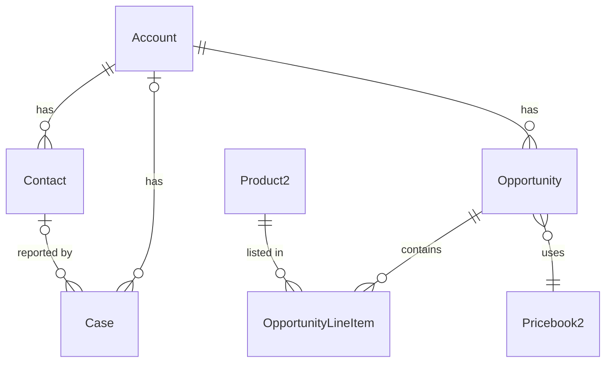
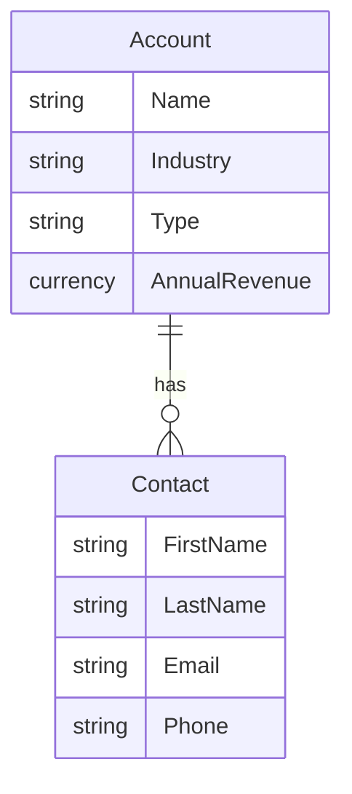
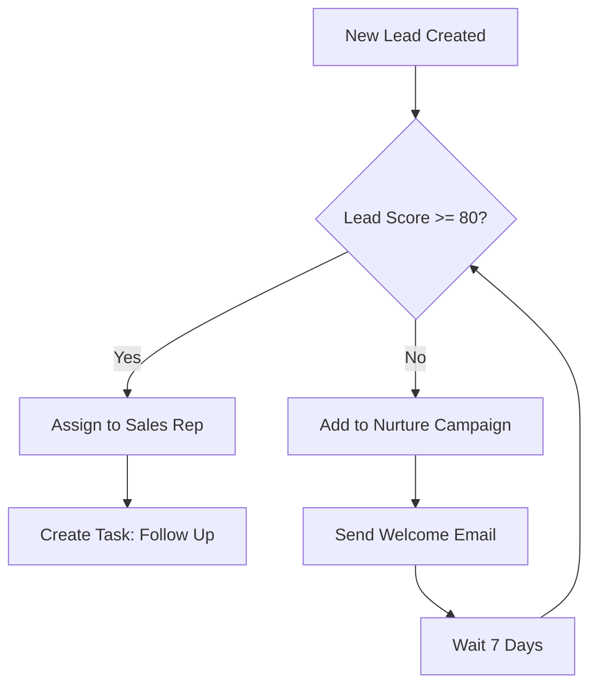
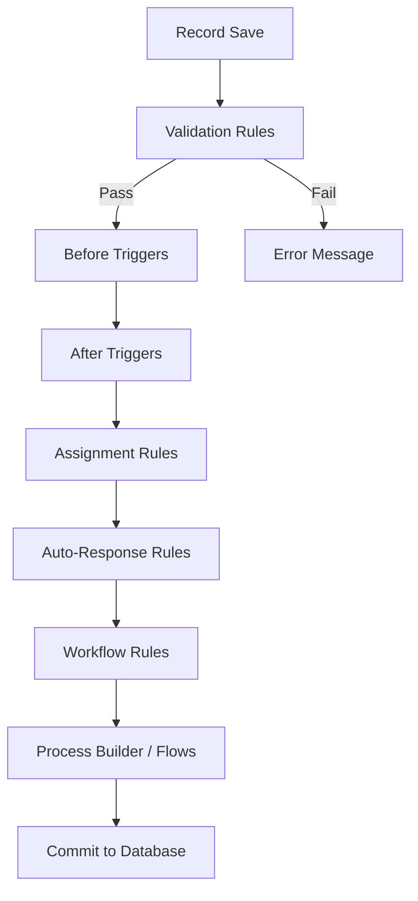
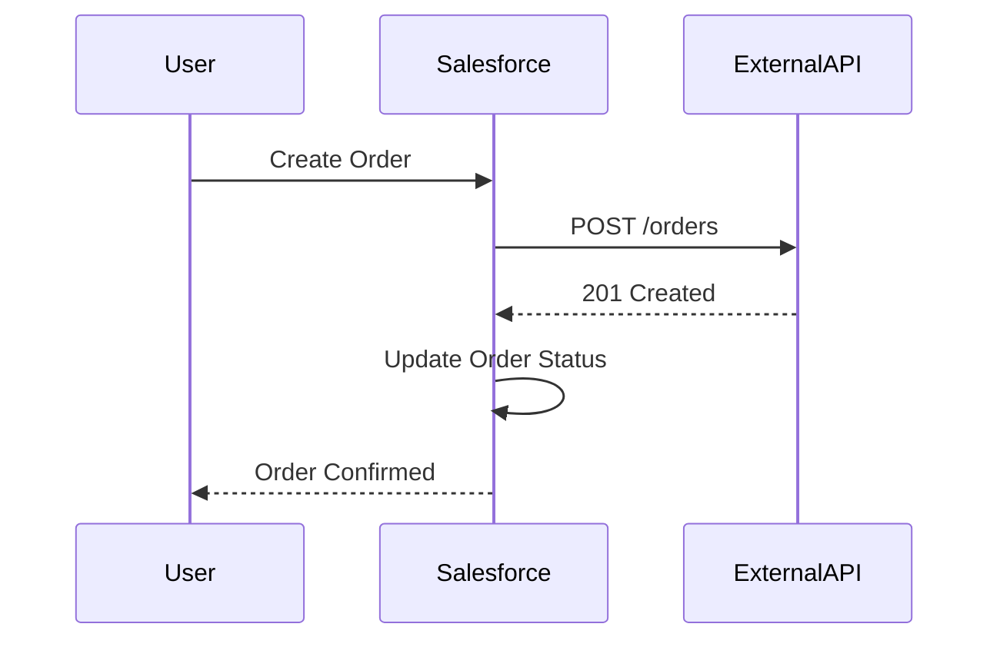

# Skill 09 — Diagrams & Documents

## When to Generate Diagrams

Use `generate_diagram` when the user asks for:
- Data model / ERD diagrams showing object relationships
- Process flow diagrams (lead conversion, opportunity pipeline, case escalation)
- Automation flow diagrams (trigger → handler → flow chains)
- Sequence diagrams for integration flows
- Any request for a "visual", "diagram", "chart", or "map" of their org

## Mermaid Syntax Patterns for Salesforce

### ERD — Object Relationships

Use `erDiagram` for data model diagrams. Map Salesforce relationships:
- Master-Detail → `||--o{` (parent required, one-to-many)
- Lookup → `|o--o{` (parent optional, one-to-many)
- Junction object → two `}o--||` relationships



### ERD — Show Key Fields

Add field annotations inside the entity block:



### Flowchart — Process Flows

Use `flowchart TD` (top-down) or `flowchart LR` (left-right) for process diagrams:



### Flowchart — Automation Chain

Show how triggers, flows, and validation rules interact:



### Sequence Diagram — Integration Flow

Use `sequenceDiagram` for API integration flows:



## Tips for Readable Diagrams

1. **Keep it under ~15 nodes** — large diagrams become unreadable as PNGs in Slack
2. **Use short labels** — `Opp` instead of `OpportunityLineItem`, abbreviate where obvious
3. **Group related items** — use subgraphs in flowcharts for logical grouping
4. **Top-down layout** (`TD`) works best for process flows; **left-right** (`LR`) for timelines
5. **Always query the org first** — use `describe_object` or `query_tooling` to get actual field names and relationships before building the diagram
6. **Sanitize special characters** — avoid quotes, parentheses, and special characters in node labels; use square brackets `[label]` for nodes

## When to Generate Documents

Use `generate_document` when the user asks for:
- Test scripts / test plans with step-by-step instructions
- Runbooks for operational procedures
- Checklists (deployment, go-live, UAT)
- Migration plans or data mapping documents
- Any structured content that would exceed ~2000 characters

### Document Structure Best Practices

- Start with a clear title and purpose section
- Use headers (##) to organize sections
- Use numbered lists for sequential steps
- Use tables for field mappings, test data, or comparisons
- Include "Expected Result" for each test step
- End with a summary or sign-off section

### Example: Test Script Structure

```markdown
# Test Script: [Feature Name]

## Objective
Brief description of what is being tested.

## Prerequisites
- [ ] User has X permission
- [ ] Test data has been created

## Test Steps

### TC-01: [Test Case Name]
| Step | Action | Expected Result |
|------|--------|----------------|
| 1 | Navigate to ... | Page loads |
| 2 | Click ... | Modal appears |
| 3 | Enter ... | Field accepts input |
| 4 | Save | Record created successfully |

## Sign-Off
| Role | Name | Date | Status |
|------|------|------|--------|
| Tester | | | |
| Business Owner | | | |
```
