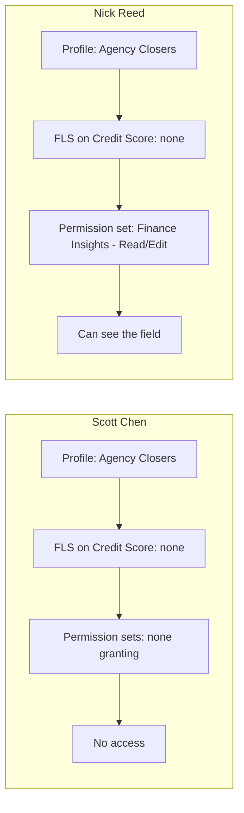
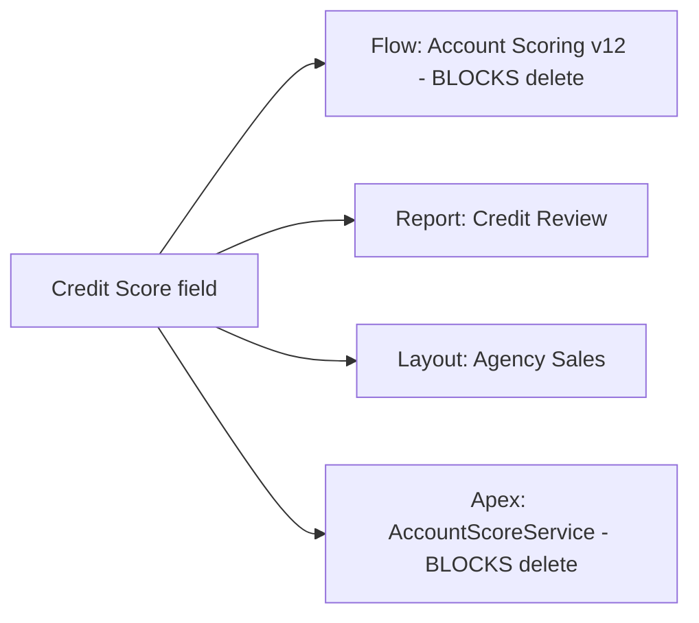
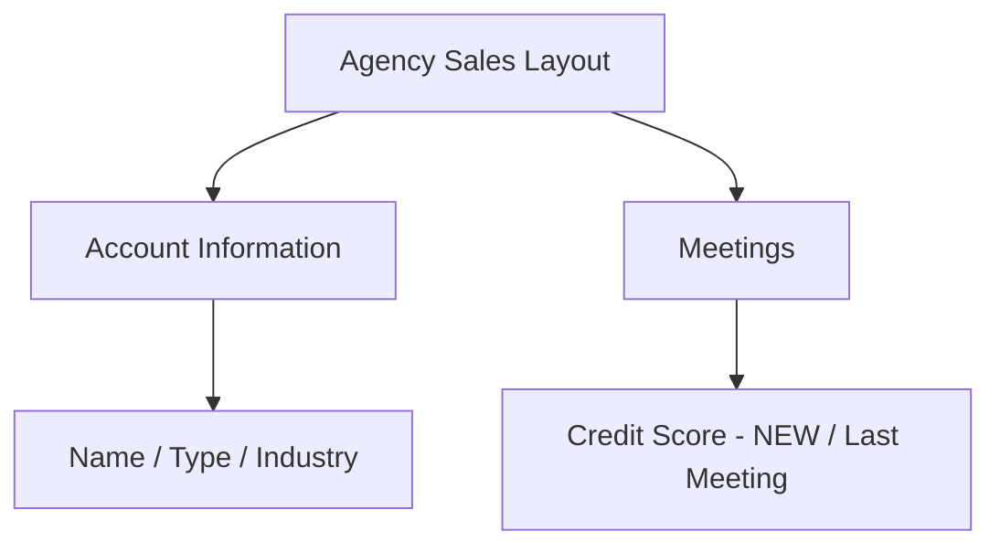
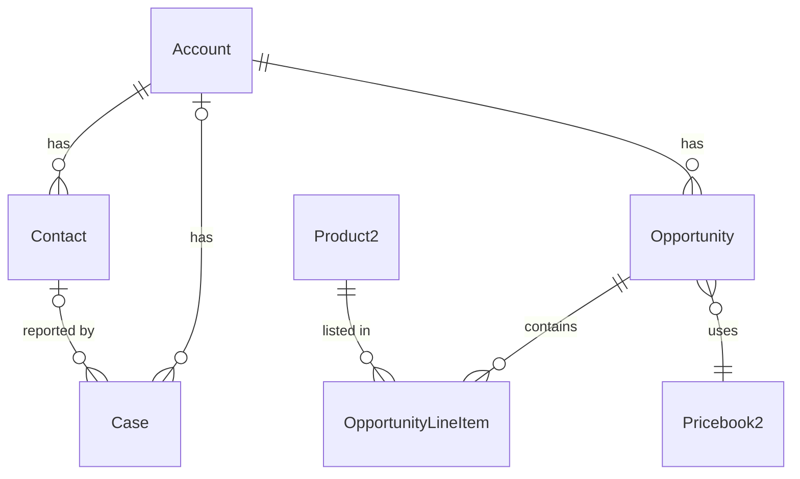
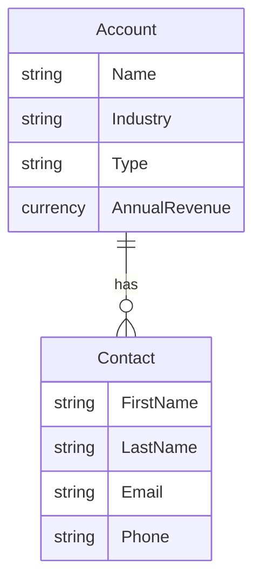
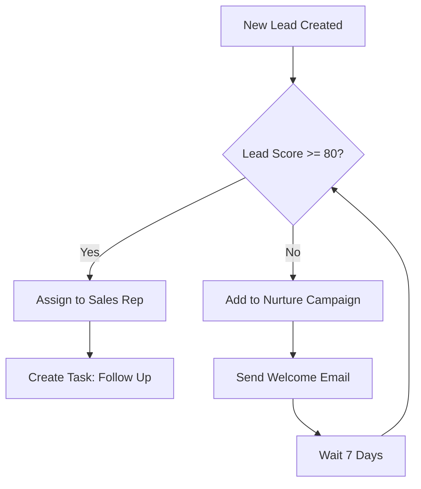
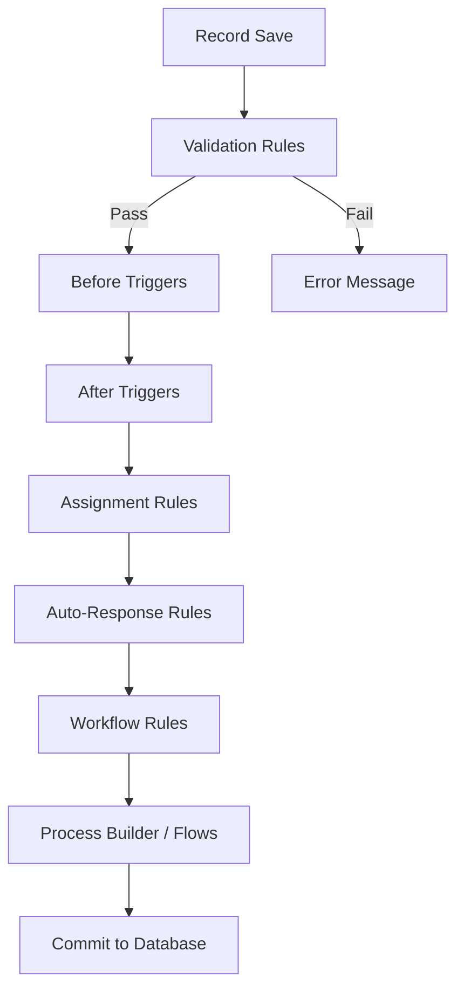
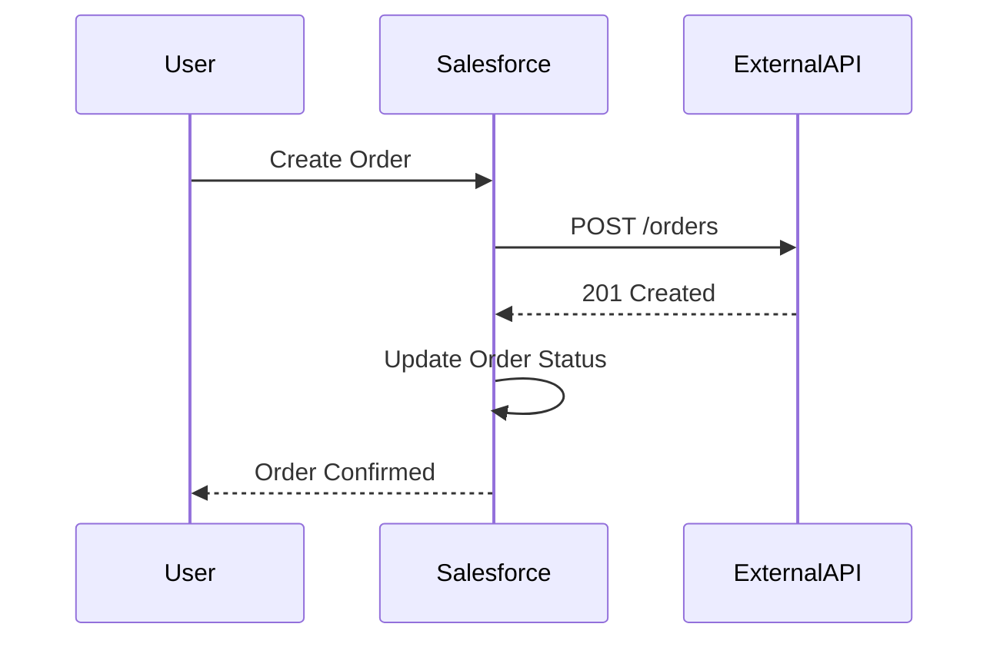

# Skill 09 — Diagrams & Documents

## When to Generate Diagrams

Do NOT wait for the user to say "diagram". Draw one whenever the picture explains the
answer better than prose. Always pass `diagram_type` — the skeleton for each type is
below and the tool rejects a mismatch (e.g. declaring `access_path` and writing an ERD).

| Situation | `diagram_type` | What the picture shows |
|---|---|---|
| "Why can X see this but Y can't?" / any access or visibility investigation | `access_path` | One lane per user: profile → FLS → permission sets → result |
| "Why can't I delete this?" / "what uses this field?" | `dependency_map` | The component in the centre, everything referencing it pointing in |
| "What automation runs on Opportunity?" | `automation_chain` | Triggers, flows and rules in execution order |
| A flow or process you are about to build or have been asked to explain | `process` | Trigger → decisions → actions |
| Objects and how they relate | `erd` | Entities + relationship cardinality |
| Where fields sit on a page layout | `layout_map` | Sections in order with their fields |

Rules that matter more than the type:

- **Ground every node in a tool result.** Never draw a profile, permission set, user or
  component you haven't confirmed from the org in this conversation. A confident wrong
  diagram is worse than no diagram.
- **The diagram supports the answer, it doesn't replace it.** Still state the finding and
  the recommendation in text.
- **One idea per diagram.** Two clear diagrams beat one dense one.
- **Skip it when the answer is one fact.** "The field is called Credit_Score__c" needs no picture.

### Access path — why one user can and another can't

The single most valuable diagram: put each user in their own lane and let the
difference show itself.


```mermaid
flowchart LR
    subgraph Scott["Scott Chen"]
        S1[Profile: Agency Closers] --> S2[FLS on Credit Score: none]
        S2 --> S3[Permission sets: none granting]
        S3 --> S4[No access]
    end
    subgraph Nick["Nick Reed"]
        N1[Profile: Agency Closers] --> N2[FLS on Credit Score: none]
        N2 --> N3[Permission set: Finance Insights - Read/Edit]
        N3 --> N4[Can see the field]
    end
```

Use `flowchart LR` for access paths: each user's lane then stacks vertically and the
image stays readable in Slack. `flowchart TD` puts the lanes side by side and produces a
very wide, unreadable strip.

List only what the user actually HAS. Don't list a permission set in someone's lane and
mark it with an ✗ — that reads as if they have it. Show the missing grant as its own node
in the lane that has it (as "Finance Insights - Read/Edit" above), and let the other lane
simply end at "No access".

Include only the steps you actually checked. If sharing rules or a permission set group
are part of the answer, add them as nodes in the lane where they apply.

### Dependency map — what blocks a delete


```mermaid
flowchart LR
    F[Credit Score field] --> A[Flow: Account Scoring v12 - BLOCKS delete]
    F --> B[Report: Credit Review]
    F --> C[Layout: Agency Sales]
    F --> D[Apex: AccountScoreService - BLOCKS delete]
```

Mark which references actually block the operation and which are merely affected.

### Layout map — sections and fields


```mermaid
flowchart TD
    L[Agency Sales Layout] --> S1[Account Information]
    S1 --> F1[Name / Type / Industry]
    L --> S2[Meetings]
    S2 --> F2[Credit Score - NEW / Last Meeting]
```

## Mermaid Syntax Patterns for Salesforce

### ERD — Object Relationships

Use `erDiagram` for data model diagrams. Map Salesforce relationships:
- Master-Detail → `||--o{` (parent required, one-to-many)
- Lookup → `|o--o{` (parent optional, one-to-many)
- Junction object → two `}o--||` relationships


```mermaid
erDiagram
    Account ||--o{ Contact : has
    Account ||--o{ Opportunity : has
    Account |o--o{ Case : has
    Opportunity ||--o{ OpportunityLineItem : contains
    Product2 ||--o{ OpportunityLineItem : "listed in"
    Contact |o--o{ Case : "reported by"
    Opportunity }o--|| Pricebook2 : uses
```

### ERD — Show Key Fields

Add field annotations inside the entity block:


```mermaid
erDiagram
    Account {
        string Name
        string Industry
        string Type
        currency AnnualRevenue
    }
    Contact {
        string FirstName
        string LastName
        string Email
        string Phone
    }
    Account ||--o{ Contact : has
```

### Flowchart — Process Flows

Use `flowchart TD` (top-down) or `flowchart LR` (left-right) for process diagrams:


```mermaid
flowchart TD
    A[New Lead Created] --> B{Lead Score >= 80?}
    B -->|Yes| C[Assign to Sales Rep]
    B -->|No| D[Add to Nurture Campaign]
    C --> E[Create Task: Follow Up]
    D --> F[Send Welcome Email]
    F --> G[Wait 7 Days]
    G --> B
```

### Flowchart — Automation Chain

Show how triggers, flows, and validation rules interact:


```mermaid
flowchart TD
    A[Record Save] --> B[Validation Rules]
    B -->|Pass| C[Before Triggers]
    C --> D[After Triggers]
    D --> E[Assignment Rules]
    E --> F[Auto-Response Rules]
    F --> G[Workflow Rules]
    G --> H[Process Builder / Flows]
    H --> I[Commit to Database]
    B -->|Fail| J[Error Message]
```

### Sequence Diagram — Integration Flow

Use `sequenceDiagram` for API integration flows:


```mermaid
sequenceDiagram
    participant User
    participant Salesforce
    participant ExternalAPI
    User->>Salesforce: Create Order
    Salesforce->>ExternalAPI: POST /orders
    ExternalAPI-->>Salesforce: 201 Created
    Salesforce->>Salesforce: Update Order Status
    Salesforce-->>User: Order Confirmed
```

## Tips for Readable Diagrams

1. **Keep it to ~12 nodes** (hard ceiling ~15) — large diagrams become unreadable as PNGs in Slack
2. **Use short labels** — `Opp` instead of `OpportunityLineItem`, abbreviate where obvious
3. **Group related items** — use subgraphs in flowcharts for logical grouping
4. **Top-down layout** (`TD`) works best for process flows; **left-right** (`LR`) for timelines
5. **Always query the org first** — use `describe_object` or `query_tooling` to get actual field names and relationships before building the diagram
6. **Sanitize special characters** — avoid quotes, parentheses, and special characters in node labels; use square brackets `[label]` for nodes

## When to Generate Documents

Use `generate_document` when the user asks for:
- Test scripts / test plans with step-by-step instructions
- Runbooks for operational procedures
- Checklists (deployment, go-live, UAT)
- Migration plans or data mapping documents
- Any structured content that would exceed ~2000 characters

### Document Structure Best Practices

- Start with a clear title and purpose section
- Use headers (##) to organize sections
- Use numbered lists for sequential steps
- Use tables for field mappings, test data, or comparisons
- Include "Expected Result" for each test step
- End with a summary or sign-off section

### Example: Test Script Structure

```markdown
# Test Script: [Feature Name]

## Objective
Brief description of what is being tested.

## Prerequisites
- [ ] User has X permission
- [ ] Test data has been created

## Test Steps

### TC-01: [Test Case Name]
| Step | Action | Expected Result |
|------|--------|----------------|
| 1 | Navigate to ... | Page loads |
| 2 | Click ... | Modal appears |
| 3 | Enter ... | Field accepts input |
| 4 | Save | Record created successfully |

## Sign-Off
| Role | Name | Date | Status |
|------|------|------|--------|
| Tester | | | |
| Business Owner | | | |
```
